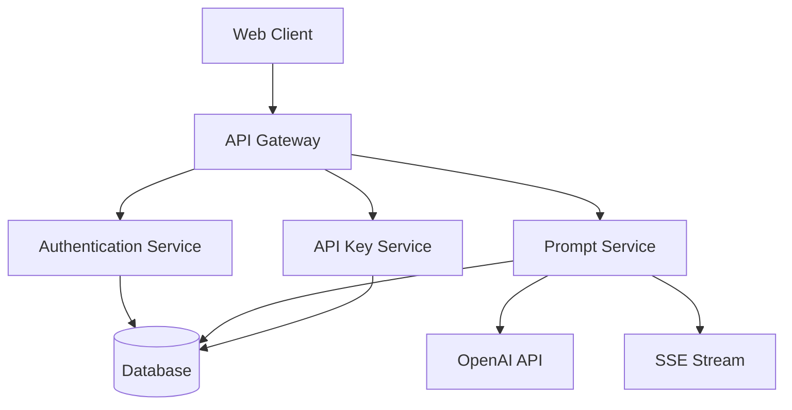

# Auto Prompt 开发者文档

[](../LICENSE)
[]()
[](docs/README.md)

## 📚 文档导航

本目录包含 Auto Prompt 平台的完整技术文档，为开发者提供详细的集成指南和API参考。

### 🔑 API Key 管理
- [API Key 使用指南](./api-key-guide.md) - 创建、管理和使用API密钥
- [认证与授权](./authentication.md) - 用户认证和权限管理

### 🌊 流式处理
- [SSE 解析文档](./sse-integration.md) - Server-Sent Events 实现详解
- [流式响应处理](./streaming-guide.md) - 实时数据流处理最佳实践

### 🔧 接口集成
- [参数解析 API](./parameter-parsing.md) - 提示词参数自动解析
- [接口调用示例](./api-examples.md) - 完整的代码示例

### 📋 快速开始

1. **环境准备**
   ```bash
   # 克隆项目
   git clone <repository-url>
   cd auto-prompt
   
   # 启动服务
   ./deploy.sh
   ```

2. **获取API密钥**
   - 访问 [平台管理页面](http://localhost:10426/apikeys)
   - 创建新的API密钥
   - 保存密钥供后续使用

3. **集成测试**
   ```bash
   # 测试API连通性
   curl -H "Authorization: Bearer YOUR_TOKEN" \
        -H "api-key: YOUR_API_KEY" \
        http://localhost:10426/v1/models
   ```

## 🏗️ 架构概览



## 📖 技术栈

- **后端**: .NET 9.0, Entity Framework Core
- **前端**: React 18, TypeScript, Ant Design
- **数据库**: PostgreSQL / SQLite
- **实时通信**: Server-Sent Events (SSE)
- **AI服务**: OpenAI API Compatible

## 🤝 贡献指南

我们欢迎社区贡献！请查看以下资源：

- [贡献指南](../CONTRIBUTING.md)
- [代码规范](./coding-standards.md)
- [问题报告](../issues)

## 📄 许可证

本项目采用 MIT 许可证 - 查看 [LICENSE](../LICENSE) 文件了解详情。

## 🆘 支持

- 📧 邮箱: support@example.com
- 💬 社区: [Discord](https://discord.gg/example)
- 📝 文档: [在线文档](https://docs.example.com)
- 🐛 问题: [GitHub Issues](https://github.com/example/auto-prompt/issues) 